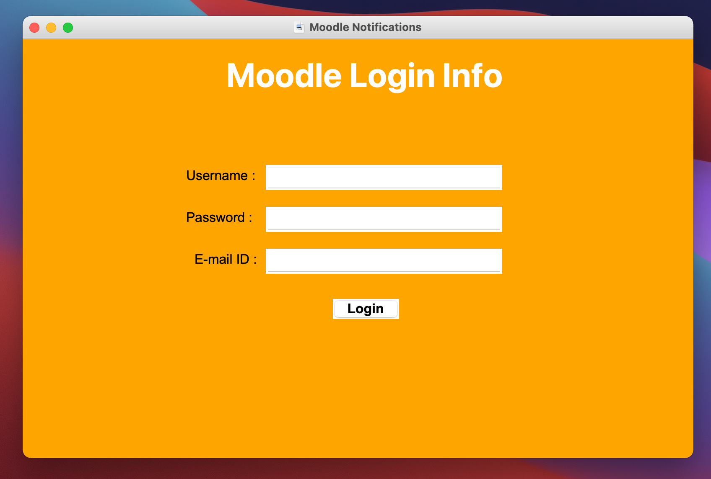

# Moodle Notifications

We noticed that moodle does not have a notification system to notify the user whenever a new file or quiz has been uploaded on moodle by the instructor. So, we implemented our own notification system for moodle using web scraping. The user will receive a notification whenever an instructor has uploaded a new file/quiz. Our application also sends a daily e-mail digest to the user's e-mail id. This e-mail digest will contain all the activities that happened in moodle on that day, along with the corresponding links for better accessibility.
 
## Note: Run main.py
 

## Table of Contents  
 - [User Login](#user-login)  
 - [Notifications](#notifications)
 - [Mail](#mail)  
 - [Future References](#future-features)

 
<a name="user-login"/>

## User Login
On starting the code, a form is shown which askes the user their moodle username, password and email id.

 
 
 
<a name="notifications"/>

## Notifications

Whenever a new file is added to the user's moodle account, the user receives a notification on their screen.
 

 
<a name="mail"/>

## Mail
At the end of the day(between 8 and 9 pm), the user receives a mail containing all the files added on that day along with the links.
 
  
 
<a name="future-references"/>

## Future Features

 - Getting access to moodle API and making a moodle plugin.
 - Making a mobile version.
 - Include  chats from contacts.
